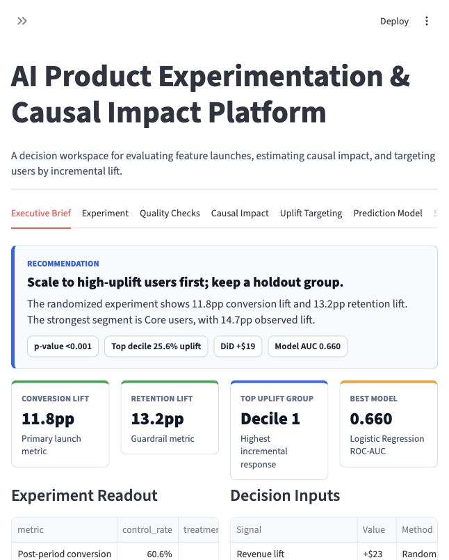
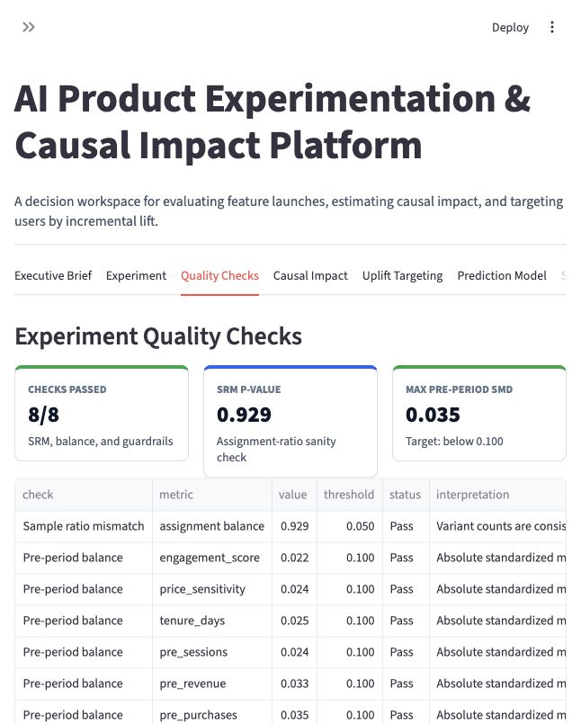
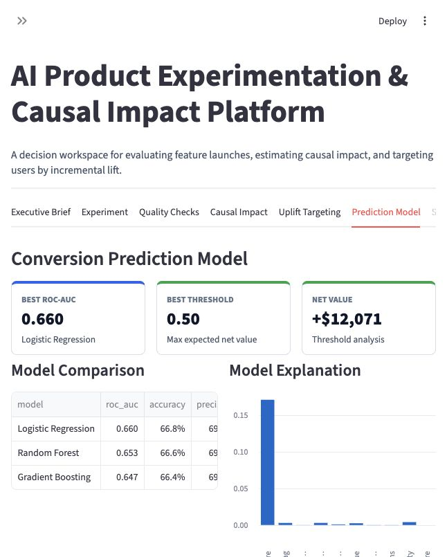
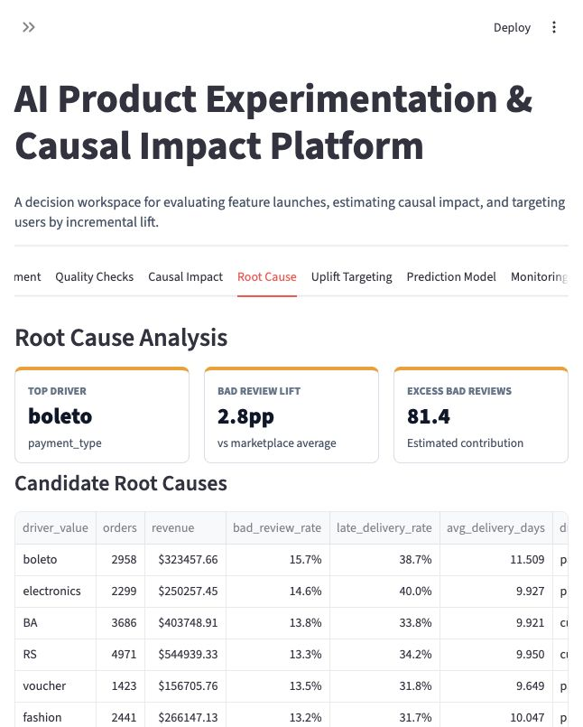
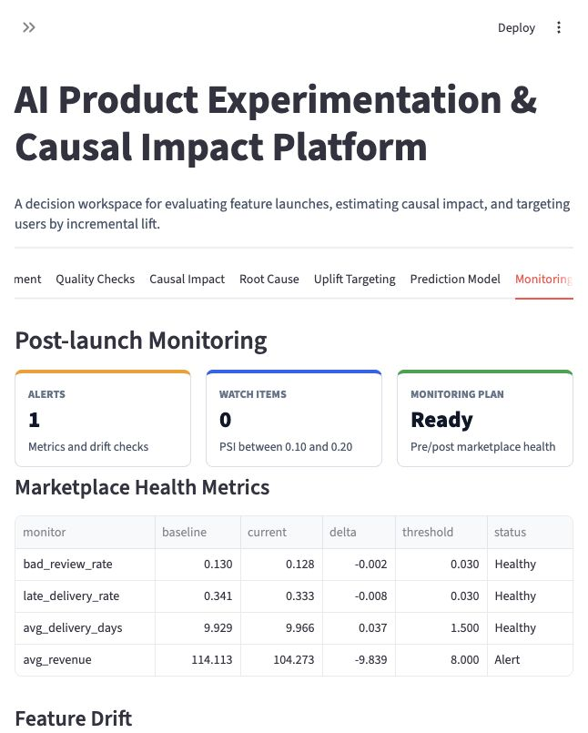
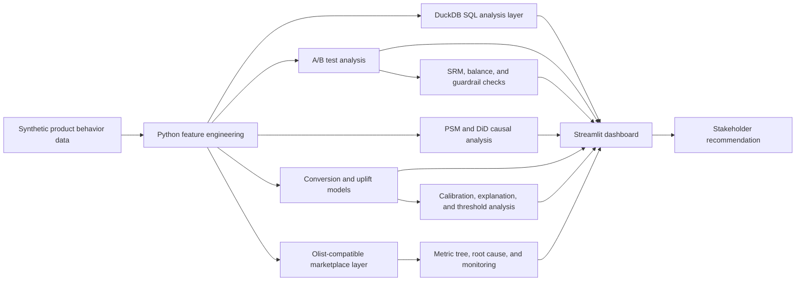

# Product Experimentation & Causal Impact Platform

An end-to-end product data science project for experimentation, causal inference, marketplace root-cause analysis, uplift targeting, and stakeholder-ready recommendations.

[Live Demo](https://ai-experiment-causal-impact.streamlit.app/) | [GitHub Repository](https://github.com/HebeiZywoo/Product-Experimentation-Platform)

## 30-Second Summary

This project answers a realistic product data science question:

> Should the team scale an AI onboarding recommendation feature, which users should receive the next intervention, and what marketplace operational risks could block the launch?

I built a full workflow with Python, DuckDB SQL, scikit-learn, statsmodels, and Streamlit. The platform generates realistic product behavior data, analyzes a randomized experiment, estimates observational campaign impact with propensity score matching and difference-in-differences, trains conversion and uplift models, adds an Olist-compatible marketplace layer, and turns the results into a launch recommendation with root-cause and monitoring checks.

## Key Results

| Area | Result |
|---|---:|
| Users | 8,000 |
| Daily activity rows | 784,000 |
| Randomized conversion lift | 11.8 percentage points |
| Randomized retention lift | 13.2 percentage points |
| DiD revenue impact | $19.10 per exposed user |
| PSM conversion ATT | 12.1 percentage points |
| Best predictive model | Logistic Regression |
| Best ROC-AUC | 0.660 |
| Experiment QA | 8 / 8 checks passed |
| Recommended model threshold | 0.50 |
| Expected net value at threshold | $12,071 |
| Marketplace orders | 16,780 |
| Marketplace source | Olist-compatible fallback |

## Why This Project Matters

Many analytics projects stop at "I trained a model." This one shows the broader product data science workflow:

- Frame a product launch decision.
- Build reusable SQL analysis tables.
- Analyze funnel, cohort, retention, and revenue metrics.
- Connect product lift to marketplace quality metrics and operational guardrails.
- Run A/B test statistics with confidence intervals and power analysis.
- Use causal methods for non-randomized campaigns.
- Diagnose root causes behind bad reviews and late delivery.
- Train uplift models to target users who benefit from treatment.
- Check experiment quality before trusting lift.
- Define a metric tree and monitoring plan before recommending rollout.
- Explain model behavior with permutation importance and feature direction.
- Calibrate model scores and choose a business-value threshold.
- Communicate model results and causal limitations clearly.
- Deploy an interactive dashboard with a grounded analyst copilot.

## Dashboard

The Streamlit app includes:

- Executive Brief: launch recommendation and key metrics.
- Marketplace Case: data source status, metric tree, and marketplace order layer.
- Experiment: A/B lift, segment lift, and power analysis.
- Quality Checks: sample ratio mismatch, pre-period balance, and guardrail checks.
- Causal Impact: propensity score matching and difference-in-differences.
- Root Cause: marketplace driver analysis for bad reviews and late delivery.
- Uplift Targeting: T-learner uplift deciles and targeting priorities.
- Prediction Model: model comparison, model explanation, calibration, and threshold business value.
- Monitoring: post-launch metric thresholds, alert states, and feature drift checks.
- SQL Tables: DuckDB-generated analysis tables.
- Analyst Copilot: grounded explanations over the project outputs.

### Executive Brief



### Experiment QA



### Model Diagnostics



### Root Cause



### Monitoring



## Technical Architecture



## Project Structure

```text
.
├── app/
│   └── streamlit_app.py
├── data/
│   ├── raw/
│   └── processed/
├── docs/
│   ├── case_study.md
│   ├── data_dictionary.md
│   ├── experiment_design.md
│   ├── metric_tree.md
│   └── model_card.md
├── reports/
│   ├── executive_brief.png
│   ├── model_diagnostics.png
│   ├── monitoring.png
│   ├── root_cause.png
│   └── quality_checks.png
├── scripts/
│   ├── generate_data.py
│   ├── run_analysis.py
│   ├── run_pipeline.py
│   └── run_sql_analysis.py
├── sql/
│   └── product_experiment_analysis.sql
└── src/
    └── product_experiment_ds/
```

## Quick Start

### Option A: Anaconda

```bash
conda env create -f conda_environment.yml
conda activate product-experiment-ds
python scripts/run_pipeline.py
streamlit run app/streamlit_app.py
```

### Option B: venv

```bash
python3 -m venv .venv
source .venv/bin/activate
pip install -r requirements.txt
python scripts/run_pipeline.py
streamlit run app/streamlit_app.py
```

Or use:

```bash
make all
make app
```

## Optional Real Marketplace Data

The project runs out of the box with an Olist-compatible fallback marketplace layer. To switch the marketplace tab to real Olist data, place these Kaggle CSVs under `data/olist/` and rerun `python scripts/run_pipeline.py`:

- `olist_orders_dataset.csv`
- `olist_order_items_dataset.csv`
- `olist_order_reviews_dataset.csv`
- `olist_customers_dataset.csv`
- `olist_products_dataset.csv`
- `olist_order_payments_dataset.csv`
